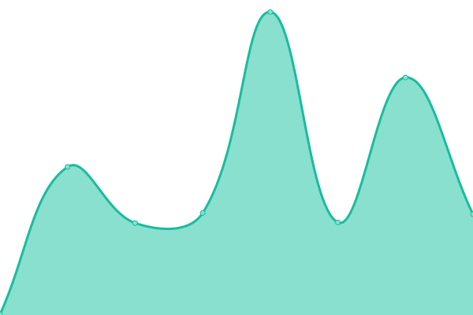

# [📈 Live Status](https://BasiraLimted.github.io/statebasira): <!--live status--> **🟧 Partial outage**

This repository contains the open-source uptime monitor and status page for [BasiraLimted](https://BasiraLimted.github.io/basirastate), powered by [Upptime](https://github.com/upptime/upptime).

With [Upptime](https://upptime.js.org), you can get your own unlimited and free uptime monitor and status page, powered entirely by a GitHub repository. We use [Issues](https://github.com/BasiraLimted/basirastate/issues) as incident reports, [Actions](https://github.com/BasiraLimted/basirastate/actions) as uptime monitors, and [Pages](https://BasiraLimted.github.io/basirastate) for the status page.

<!--start: status pages-->
<!-- This summary is generated by Upptime (https://github.com/upptime/upptime) -->
<!-- Do not edit this manually, your changes will be overwritten -->
<!-- prettier-ignore -->
| URL | Status | History | Response Time | Uptime |
| --- | ------ | ------- | ------------- | ------ |
|  [Basira App](https://www.basira.app) | 🟩 Up | [basira-app.yml](https://github.com/BasiraLimted/basirastate/commits/HEAD/history/basira-app.yml) | 

 271ms
     
 | 

<a href="https://BasiraLimted.github.io/basirastate/history/basira-app">97.32%</a>
    

|  [Basira Stage App](https://stage.market.basira.app) | 🟩 Up | [basira-stage-app.yml](https://github.com/BasiraLimted/basirastate/commits/HEAD/history/basira-stage-app.yml) | 

 277ms
     
 | 

<a href="https://BasiraLimted.github.io/basirastate/history/basira-stage-app">97.32%</a>
    

|  [Market Basira](https://market.basira.app) | 🟩 Up | [market-basira.yml](https://github.com/BasiraLimted/basirastate/commits/HEAD/history/market-basira.yml) | 

 250ms
     
 | 

<a href="https://BasiraLimted.github.io/basirastate/history/market-basira">97.33%</a>
    

|  [Live API](https://api.basira.app) | 🟥 Down | [live-api.yml](https://github.com/BasiraLimted/basirastate/commits/HEAD/history/live-api.yml) | 

 233ms
     
 | 

<a href="https://BasiraLimted.github.io/basirastate/history/live-api">0.00%</a>
    

|  [Stage API](https://stage.api.basira.app) | 🟥 Down | [stage-api.yml](https://github.com/BasiraLimted/basirastate/commits/HEAD/history/stage-api.yml) | 

 442ms
     
 | 

<a href="https://BasiraLimted.github.io/basirastate/history/stage-api">0.00%</a>
    

<!--end: status pages-->

[**Visit our status website →**](https://BasiraLimted.github.io/basirastate)

Powered by: [Upptime](https://github.com/upptime/upptime)
