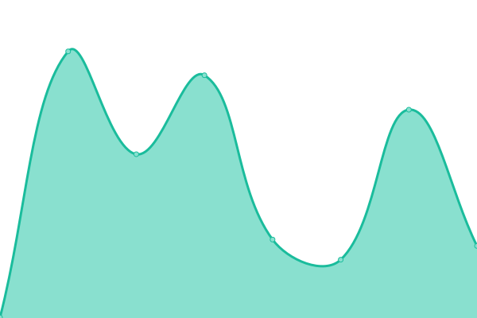

# # [📈 Live Status](https://BasiraLimted.github.io/statebasira): <!--live status--> **🟩 All systems operational**

<!--start: description-->

This repository contains the **Basira App** uptime monitor and status page for [Basira App](http://basira.app), powered by [Upptime](https://github.com/upptime/upptime).

<!--end: description-->

## [📈 Live Status](https://demo.upptime.js.org): <!--live status--> **🟧 Partial outage**

<!--start: status pages-->
<!-- This summary is generated by Upptime (https://github.com/BasiraLimted/basirastate) -->
<!-- Do not edit this manually, your changes will be overwritten -->
<!-- prettier-ignore -->
| URL | Status | History | Response Time | Uptime |
| --- | ------ | ------- | ------------- | ------ |
|  [Google](https://www.google.com) | 🟩 Up | [google.yml](https://github.com/BasiraLimted/basirastate/commits/HEAD/history/google.yml) | 

 86ms
     
 | 

<a href="https://demo.upptime.js.org/history/google">100.00%</a>
    

|  [Wikipedia](https://en.wikipedia.org) | 🟩 Up | [wikipedia.yml](https://github.com/BasiraLimted/basirastate/commits/HEAD/history/wikipedia.yml) | 

 185ms
     
 | 

<a href="https://demo.upptime.js.org/history/wikipedia">100.00%</a>
    

|  [Hacker News](https://news.ycombinator.com) | 🟩 Up | [hacker-news.yml](https://github.com/BasiraLimted/basirastate/commits/HEAD/history/hacker-news.yml) | 

 294ms
     
 | 

<a href="https://demo.upptime.js.org/history/hacker-news">100.00%</a>
    

|  [Test Broken Site](https://thissitedoesnotexist.koj.co) | 🟥 Down | [test-broken-site.yml](https://github.com/BasiraLimted/basirastate/commits/HEAD/history/test-broken-site.yml) | 

 0ms
     
 | 

<a href="https://demo.upptime.js.org/history/test-broken-site">0.00%</a>
    

<!--end: status pages-->

<!--start: docs-->

## ⭐ How it works

- GitHub Actions is used as an uptime monitor
  - Every 5 minutes, a workflow visits your website to make sure it's up
  - Response time is recorded every 6 hours and committed to git
  - Graphs of response time are generated every day
- GitHub Issues is used for incident reports
  - An issue is opened if an endpoint is down
  - People from your team are assigned to the issue
  - Incidents reports are posted as issue comments
  - Issues are locked so non-members cannot comment on them
  - Issues are closed automatically when your site comes back up
  - Slack notifications are sent on updates
- GitHub Pages is used for the status website
  - A simple, beautiful, and accessible PWA is generated
  - Built with Svelte and Sapper
  - Fetches data from this repository using the GitHub API

#### Commits for response time

Four times per day, another workflow runs and records the response time of your websites. This data is committed to GitHub, so it's available in the commit history of each file ([example commit history](https://github.com/koj-co/upptime/commits/master/history/wikipedia.yml)). Then, the GitHub API is used to graph the response time history of each endpoint and to track when a site went down.

[**Visit our status website →**](https://EddieHubCommunity.github.io/monitoring)

## 📄 License

- Powered by: [Upptime](https://github.com/upptime/upptime)
- Code: [MIT](./LICENSE) © [Basira](http://basira.app)
- Data in the `./history` directory: [Open Database License](https://opendatacommons.org/licenses/odbl/1-0/)

